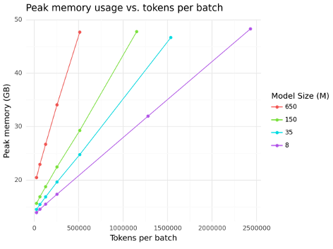
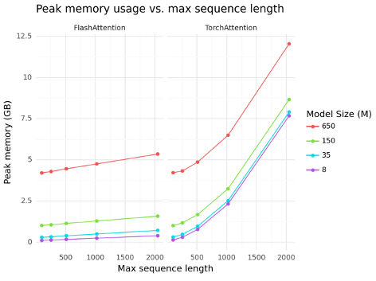
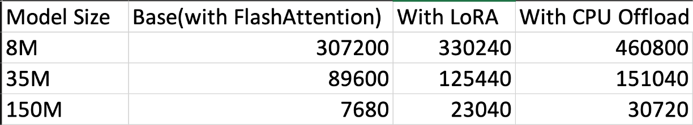
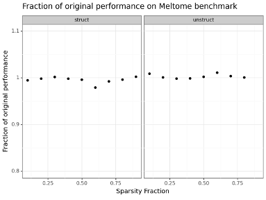
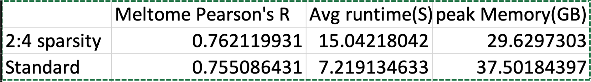

# HPML-FinalProject
This is the codebase for the HPML final project. It's a little messy, so I'll explain everything below 

Please note that `esm2.py`, `esm_data.py`, `transformer_modules.py`, and `rotary.py` are an implementation of the ESM2 protein LLM using FlashAttention that a labmate devloped and generously allowed me to use for this project. 

## Files 

figure.qmd - Quarto notebook to generate figures for presentations. Requires Quarto markdown software to run

lora_exp.py - script benchmarking performance increases using LoRA finetuning 

lora_exp_with_deepspeed.py - script benchmarking performance increase using LoRA + DeepSpeed CPU offloading 

esm2.py - Re-implementation of the ESM2 protein large language model (I did not write this)

esm_data.py - Classes for pre-processing proteins sequences as part of dataloading for model. I did not write this 

maxbsize_exp.py - Script for running experiments measuring Runtime and Peak memory usage as a function of number of tokens per batch, and maximum sequence length 

pruning.qmd - quarto notebook sketching out how to do pruning in pytorch 

rotary.py - Reference implementation of rotary embeddings(RoPE). I did not write this.

run_fixed_token_varseqlen_exp.sh - calls `maxbsize_exp.py` to actually run the different experiments profiling memory/runtime as a function of sequence length 

run_loraexp.sh - calls `lora_exp.py` and `lora_exp_with_deepspeed.py` to run the actual benchmarking experiments 

run_maxbsize_exp.py.sh - calls `maxbsize_exp.py` to actually run the different experiments profiling memory/runtime as a function of max tokens per batch size

run_structprune_exp.sh.sh - runs structured pruning experiment outlined in `struct_prune_exp.py` at difference pruning thresholds

run_unstruct_sparsityexp.sh - runs unstructured pruning experiment outlined in `sparsity_exp.py` at difference pruning thresholds

sparsity_24_exp.py - implements 2:4 semi-structured sparsity leveraging ampere sparse cuda tensors. 

struct_prune_exp.py - Experiment with structural pruning 

sparsity_exp.py - experiment with unstructured pruning 

transformer_modules.py - implementation of transformer block with FlashAttention. I did not write this 

## Data Accessibility

The two datasets I used can be downloaded from here:

Uniref50: https://ftp.uniprot.org/pub/databases/uniprot/uniref/uniref50/uniref50.fasta.gz

FLIP-Meltome: https://github.com/J-SNACKKB/FLIP

If you want to be able to fully run the code, you'll need to download the ESM model weights. Instructions for this can be found on https://github.com/facebookresearch/esm/tree/main 

There are paths throughout that are hardcoded to where the above files were on my machine. You'll need to change these appropriately to whereever you download the above files. 

## Running code

The code base makes extensive use of libraries outlined in env.yml which can be run with conda. See the `run_*` scripts to re-run different experiments.

## Results

### Performance on inference with FlashAttention

Flash Attention allows for linear scaling of memory usage with sequence length. 

### Finetuning overhead with LoRA and DeepSpeed

Both LoRA and DeepSpeed allow for larger batchsizes

### Effect of Pruning on FLIP-Meltome benchmark performance 

Meltome benchmark performance is rogitbust to pruning. 

### 2:4 Semi-Structured Sparsity Results 

2:4 semi-structured sparsity reduces memory overhead, but takes 2x longer to run - this should not be the case, need to lookinto this more. 

